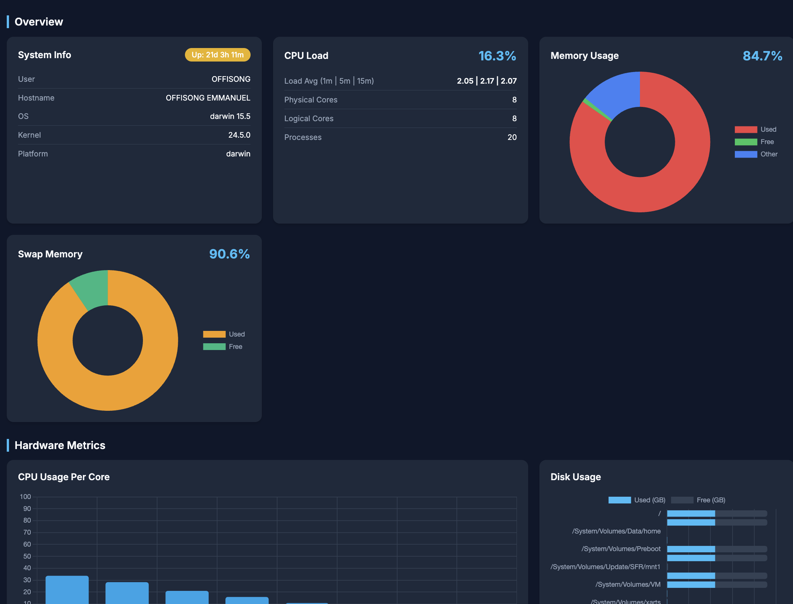
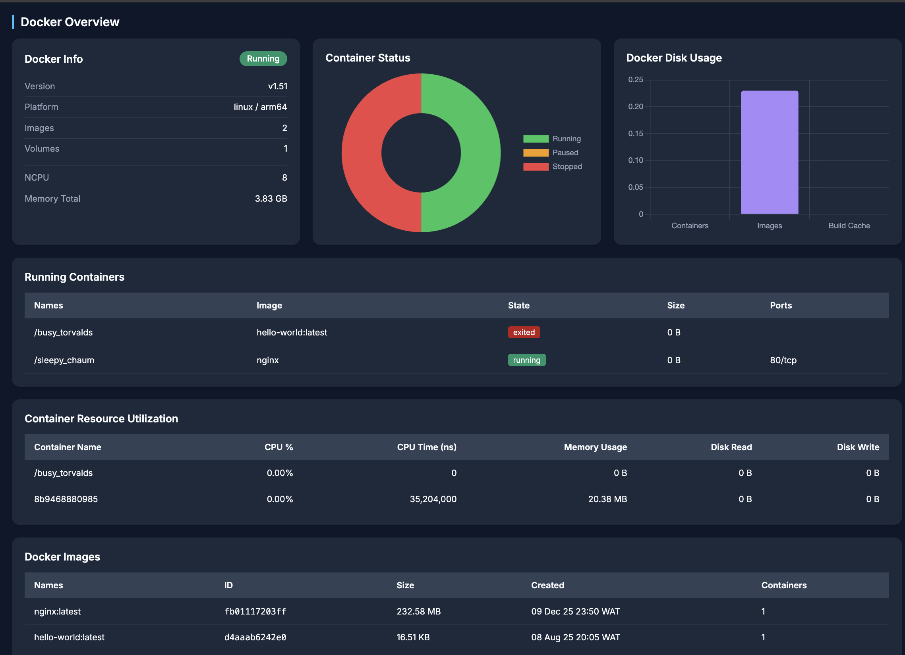
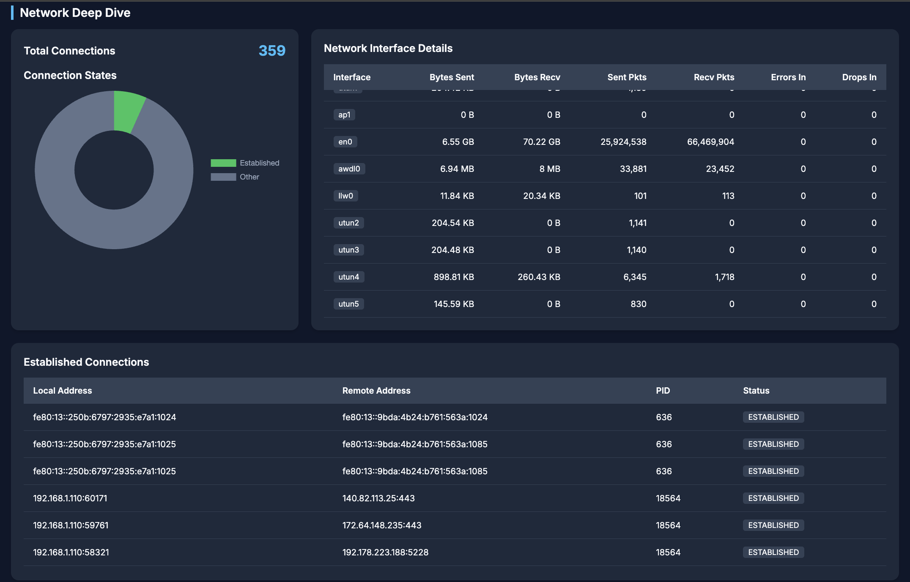
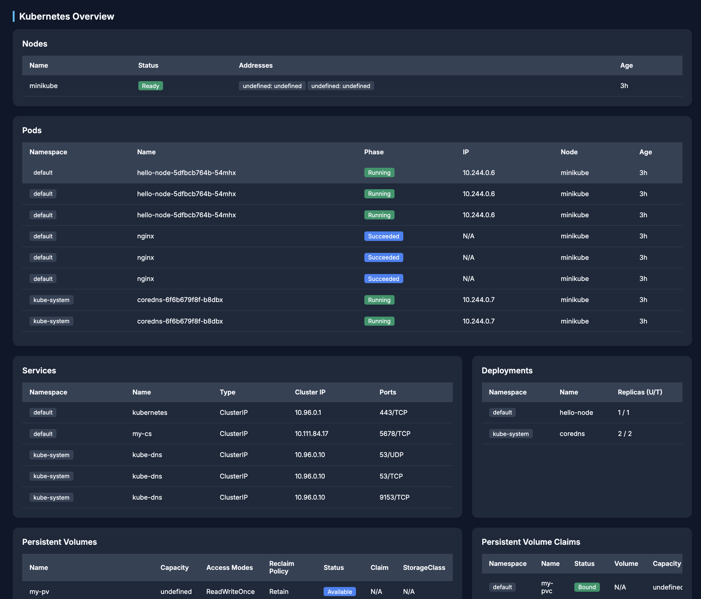
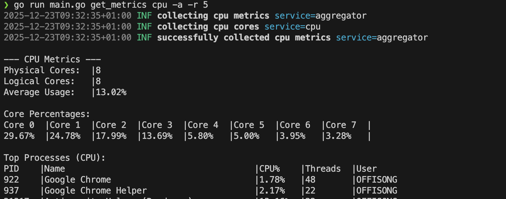

# System Monitoring Tool


A lightweight, Go-based system monitoring agent designed to collect and analyze system performance metrics including CPU, memory, disk, network, and OS information.

## Overview

This project provides a modular framework for gathering system telemetry. It leverages `gopsutil` for cross-platform metric collection and includes a structured logging system. The agent is designed to be extensible, with a  dashboard for real-time visualization. This dashboard refreshes every 30 seconds.


*Real-time System Usage Dashboard*


*Docker Resource Monitoring*


*Detailed Network Interface and Connection Stats*


*Kubernetes Cluster Monitoring*

## Features

- **CPU Monitoring**:
  - Collects physical and logical core counts.
  - Monitors CPU usage percentages (per core and average).
  - Identifies resource-intensive processes (CPU usage > 0.9%).
  - Tracks process details: PID, name, user, thread count, parent/child relationships.
  
- **Docker Monitoring** (Optional with `-d` flag):
First, ensure that docker is running locally before running the application with the `-d` flag.
  - **System Info**: NCPU, Memory Total, API Version, Platform.
  - **Container Management**: Real-time status tracking (Running, Paused, Stopped).
  - **Performance Charts**: Container distribution and Docker Disk Usage breakdown.
  - **Detailed Insights**:
    - **Containers**: Image names, current state, root size, and port mappings.
    - **Images**: Repository tags, Image IDs, virtual size, and creation dates.
    - **Volumes**: Volume names, drivers, mountpoints, and disk space usage.

- **Kubernetes Monitoring** (Optional with `-k` flag):
  - **Node Insights**: Status, internal/external addresses, and age.
  - **Pod Management**: Tracking pod phases (Running, Pending, Succeeded, Failed), IP addresses, and host nodes across all namespaces.
  - **Resource Status**: Summary of Services and Deployments with replica counts.
  - **Storage Deep-Dive**: Monitoring Persistent Volumes (PVs) and Persistent Volume Claims (PVCs) including capacity, access modes, and reclaim policies.
  - **Custom Config**: Support for custom `kubeconfig` paths via `--kubeconfig` flag.

- **Modular Architecture**:
  - Separation of concerns with dedicated packages for `cpu`, `memory`, `disk`, `network`, `os`, and `docker`.
  - Built-in `aggregator` for metric consolidation.
  - Formatted CLI reports for terminal-based monitoring.
  - Structured logging via `zerolog`.

## Project Structure

```
├── cmd/                # Application entry points
│   ├── cli.go          # CLI root command definition
│   └── run.go          # 'start' command implementation
├── internal/           # Private application layout code
│   ├── dashboard/      # Web dashboard implementation and embedded assets
│   ├── logging/        # Logging configuration and helpers
│   └── metrics/        # Metric collection modules
│       ├── aggregator/ # Aggregates collected metrics
│       ├── cpu/        # CPU stats and process monitoring
│       ├── disk/       # Disk usage and IO stats
│       ├── memory/     # RAM and Swap usage
│       ├── network/    # Network interface stats
│       ├── host/       # Host stats
│       ├── docker/     # Docker stats
│       └── user/       # User stats
├── main.go             # Main application entry point
├── experiment.go       # Experimental code snippets
└── go.mod              # Go module definition
```

## Prerequisites

- **Go**: Version 1.24.0 or higher
- **Dependencies**: Managed via `go.mod`
  - `github.com/shirou/gopsutil/v4`
  - `github.com/rs/zerolog`
  - `github.com/spf13/cobra`

## Installation

1. Clone the repository:
   ```bash
   git clone <repository-url>
   cd system-monitoring
   ```

2. Download dependencies:
   ```bash
   go mod download
   ```

## Running the Application

You can run the application directly using `go run` or by building a binary.
If you specify the -d flag, the application will collect docker metrics and add them to the dashboard. Before specifying, it is important to ensure that docker is running on your local machine otherwise, it would get the non docker metrics.

### Using `go run`

```bash
# Start the dashboard on the default port (8080)
go run main.go start

# Start on a specific port
go run main.go start --port 9090

# Start and add docker metrics to the dashboard
go run main.go start --docker 
OR
go run main.go start -d

# Start and add kubernetes metrics to the dashboard
go run main.go start -k

# Start with a specific kubeconfig path
go run main.go start -k --kubeconfig /path/to/kube/config

# Start the dashboard in the background (detached mode)
go run main.go start -D

# Start with docker and kubernetes metrics on a specific port
go run main.go start -d -k -p 9090
```


### Building the Binary

```bash
# Build the binary
go build -o sysmon main.go

# Run the binary
./sysmon start

# Run with custom port
./sysmon start --port 5555
```


### Running from release

Go to the latest release at https://github.com/Techtacles/system-monitoring/releases

```bash


# Run the binary for linux
chmod +x sysmon-linux

./sysmon-linux start

# Run with custom port
./sysmon-linux start --port 5555
OR 
./sysmon-linux start -p 5555

# Run with docker metrics
./sysmon-linux start -d

# Start and add docker metrics to the dashboard and run on a specific port
./sysmon-linux start -d -p 5555


#RUNNING THE BINARY for Windows
#Run with default 8080 port
sysmon-windows start
#Start with docker telemetry: make sure docker is running first
sysmon-windows start -d 
#start with custom port
sysmon-windows start -p 5000
# Start and add docker metrics to the dashboard and run on a specific port
sysmon-windows start -d -p 5000 


#RUNNING THE BINARY for MacOS
chmod +x sysmon-darwin
xattr -d com.apple.quarantine sysmon-darwin
#Run with default 8080 port
./sysmon-darwin start
#Start with docker telemetry: make sure docker is running first
./sysmon-darwin start -d
#start with custom port
./sysmon-darwin start -p 5555

# Start and add docker metrics to the dashboard and run on a specific port
./sysmon-darwin start -d -p 5555

```

If your OS is Apple, and you download the binary from the latest artifact, it might sometimes get flagged. To resolve this, run the command: 
```bash
chmod +x sysmon-darwin
xattr -d com.apple.quarantine sysmon-darwin
```
Once running, open your browser and navigate to `http://localhost:8080` (or your custom port) to view the dashboard.

### Using Terminal (CLI)
You can retrieve real-time metrics directly in your terminal using the `get_metrics` command. These are displayed in a clean, human-readable table format.

```bash
# Get a snapshot of specific metrics (cpu, memory, disk, network, etc.)
go run main.go get_metrics cpu

# Get all available system metrics at once
go run main.go get_metrics all

# Monitor all metrics with auto-refresh every 5 seconds
go run main.go get_metrics all -a -r 5
```


*Formatted CLI output for CPU metrics*

You can get more details in the how to use section of the README.md link: [How to use](https://github.com/Techtacles/system-monitoring/blob/master/HOW%20TO%20USE.md)

## Future enhancements

- Add cloud integrations like AWS, GCP, Azure: Load balancers, VMs, Databases, ECS
- Add more features to the dashboard
- Add alerting
- Connect to slack/teams/webhook for notifications
- Add time series analysis
- Add tabs, etc and make the dashboard more user friendly.
